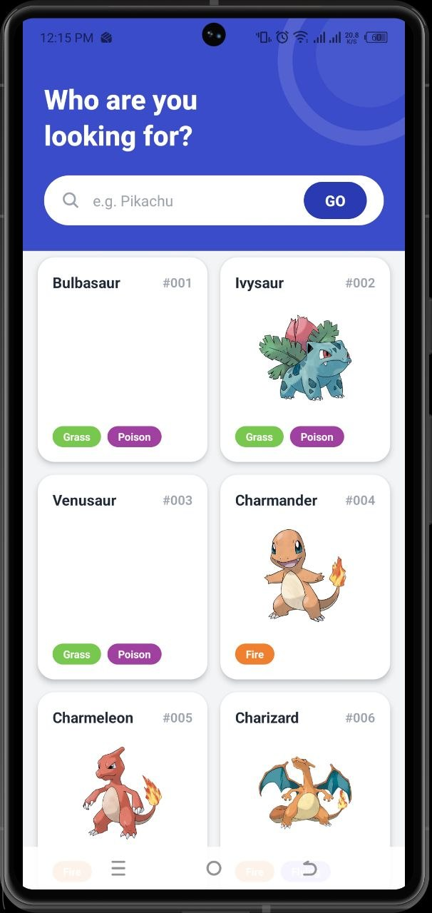
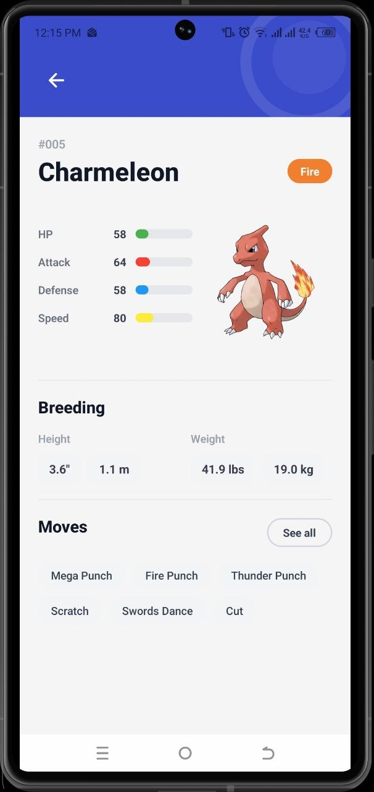

# Pokédex — React Native App

A production-quality Pokémon browser built with **Expo**, **TypeScript**, and **TanStack Query**. Fetches live data from [PokeAPI](https://pokeapi.co), displays a searchable infinite-scroll grid, and renders full stat/move/breeding detail pages — all with smooth Reanimated animations.

---

## Screenshots

| List Screen | Detail Screen |
|:---:|:---:|
|  |  |
| Blue header · search · 2-col grid | Stats bars · breeding · moves grid |

---

## Tech Stack

| Layer | Library | Version |
|---|---|---|
| Framework | Expo | SDK 54 |
| Navigation | expo-router (file-based) | ~6.0 |
| Language | TypeScript (strict) | ~5.9 |
| Server state | TanStack Query | ^5.62 |
| Animations | react-native-reanimated | ~4.1 |
| UI components | react-native-paper (MD3) | ^5.13 |
| Styling | NativeWind (Tailwind for RN) | ^4.1 |
| Images | expo-image | ~3.0 |

---

## Architecture

```
app/                        # Screens (Expo Router file-based routing)
├── _layout.tsx             # Root layout — ErrorBoundary, QueryClient, PaperProvider
├── index.tsx               # List screen — search + 2-col infinite grid
└── pokemon/[id].tsx        # Detail screen — stats, breeding, moves

components/
├── pokemon-card.tsx        # Grid card with staggered FadeInUp animation
├── type-badge.tsx          # Colored type chip (18 Pokémon types)
├── stat-bar.tsx            # Animated progress bar (Reanimated)
├── search-header.tsx       # Blue header with search input and Pokéball decor
├── pokemon-skeleton.tsx    # Shimmer loading placeholders (card, list, detail)
├── error-view.tsx          # Recoverable error state with retry
└── error-boundary.tsx      # React class error boundary for render errors

services/
└── pokeapi.ts              # Typed PokeAPI client (list, detail, search)

hooks/
└── use-pokemon.ts          # TanStack Query hooks (infinite list, detail, debounced search)

providers/
└── query-provider.tsx      # QueryClient: 5-min stale, 30-min GC, retry ×2

types/
├── pokemon.ts              # Domain models (Pokemon, PokemonListItem, …)
└── api.ts                  # Raw PokeAPI response shapes (RawPokemon, …)

utils/
├── formatters.ts           # capitalize · formatMoveName · padId
└── conversions.ts          # height/weight unit converters (dm↔m/ft, hg↔kg/lbs)

constants/
└── theme.ts                # Color tokens, type colors, stat colors
```

### Data flow

```
PokeAPI (REST)
    └── services/pokeapi.ts     (typed fetch + mapping)
        └── hooks/use-pokemon.ts    (TanStack Query cache layer)
            └── Screens / Components    (render)
```

---

## Setup

### Prerequisites

- **Node.js** ≥ 18
- **Expo CLI** — `npm install -g expo-cli`
- **Android Studio** (for emulator) or **Expo Go** on physical device

### Install & run

```bash
# 1. Install dependencies
npm install

# 2. Start the dev server
npx expo start

# In the Expo CLI menu:
#   Press a  → Android emulator
#   Press i  → iOS simulator (macOS only)
#   Scan QR  → Expo Go on physical device
```

---

## Building a Release APK

> Requires an [Expo account](https://expo.dev) and the EAS CLI.

### One-time setup

```bash
# Install EAS CLI globally
npm install -g eas-cli

# Log in to your Expo account
eas login

# Configure the project (only needed once)
eas build:configure
```

### Build a release APK (Android)

```bash
# Preview APK — installable on any device, no store signing needed
eas build --platform android --profile preview

# Production APK — for Play Store submission
eas build --platform android --profile production
```

EAS will print a build URL. Once complete, download the `.apk` from the Expo dashboard.

### Local APK build (no EAS account)

```bash
# Requires Android SDK and Java 17+ installed locally
npx expo run:android --variant release
```

The APK is output to `android/app/build/outputs/apk/release/app-release.apk`.

---

## Key Features

- **Search** — Debounced (400 ms) exact-match search via PokeAPI; results replace the grid inline.
- **Infinite Scroll** — Paginated list (20 per page) with automatic next-page fetch on scroll-to-end.
- **Staggered Animations** — Cards cascade in with `FadeInUp` + spring physics on list load.
- **Animated Stat Bars** — Stats animate from 0 to value on screen mount using cubic easing.
- **Skeleton Loading** — Shimmer placeholders (pulse opacity) replace spinners during loading.
- **Smart Caching** — TanStack Query: data is stale after 5 min, kept in memory for 30 min.
- **Type Color Palette** — All 18 Pokémon types mapped to accurate colors.
- **Dual Units** — Height and weight displayed in both metric and imperial.
- **Error Boundary** — Render-time crashes are caught and presented with a recovery button.
- **Accessibility** — Interactive elements carry `accessibilityRole` and `accessibilityLabel`.

---

## Scripts

| Command | Description |
|---|---|
| `npm start` | Start Expo dev server |
| `npm run android` | Launch on Android emulator |
| `npm run ios` | Launch on iOS simulator |
| `npm run web` | Launch in browser |
| `npm run lint` | Run ESLint |

---

## Project Decisions

### Why TanStack Query over Redux / Context?
Server state (paginated lists, detail pages) has very different caching semantics from UI state. TanStack Query handles stale-while-revalidate, deduplication, retry logic, and infinite pagination out of the box — no boilerplate required.

### Why Reanimated over Animated API?
Reanimated runs animations on the UI thread, giving consistent 60 fps even when the JS thread is busy with data fetching.

### Why separate `types/api.ts` from `types/pokemon.ts`?
The raw PokeAPI shapes and our domain models have different purposes and lifecycles. Keeping them separate means the API contract can change without touching our UI layer — and eliminates `any` casts entirely.

### Why a class-based ErrorBoundary?
React's `getDerivedStateFromError` / `componentDidCatch` lifecycle is only available in class components. All other components in the codebase are functional.
